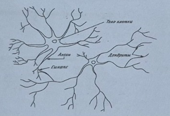
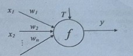
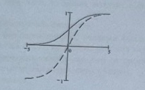
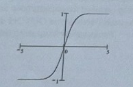
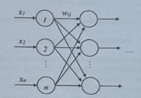
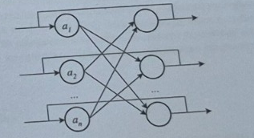
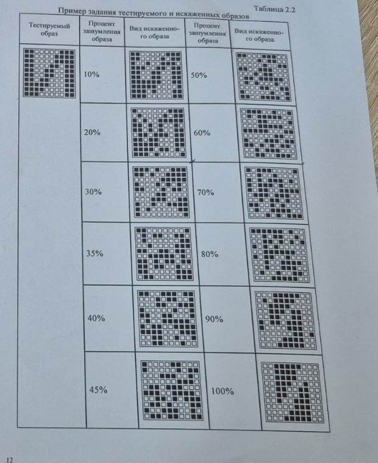

# Теоретические сведения о нейронных сетях

На рис. 1.1 показана структура пары типичных биологических нейронов. Дендриты идут от тела нервной клетки к другим нейронам, где они принимают сигналы в точках соединения, называемых синапсами. Принятые синапсом входные сигналы подводятся к телу нейрона. Здесь они суммируются, причем одни входы стремятся возбудить нейрон, другие — воспрепятствовать его возбуждению. Когда суммарное возбуждение в теле нейрона превышает некоторый порог, нейрон возбуждается, посылая по аксону сигнал другим нейронам. У этой основной функциональной схемы много усложнений и исключений, тем не менее большинство искусственных нейронных сетей моделируют лишь эти простые свойства.

_Рис. 1.1. Биологический нейрон_

Основным элементом нейронной сети является **нейрон**, который осуществляет операцию нелинейного преобразования суммы произведений входных сигналов на весовые коэффициенты:

$$
y=f\left(\sum_{i=1}^{n} w_i x_i + T\right), \tag{1.1}
$$

где $X=(x_1,x_2,\ldots,x_n)$ — вектор входного сигнала; $W=(w_1,w_2,\ldots,w_n)$ — весовой вектор; $T$ — порог; $f$ — так называемая функция активации.

Схема нейронного элемента изображена на рис. 1.2. Каждому $i$-му входу нейрона соответствует весовой коэффициент $w_i$ (синапс), который характеризует силу синаптической связи по аналогии с биологическим нейроном.

_Рис. 1.2. Искусственный нейрон_

Весовой вектор $W$, порог $T$ и пороговая функция $f$ определяют поведение любого нейрона — его реакцию на входные данные. Величина веса $w_i$ определяет степень влияния входа $i$ на выход нейрона, а знак — характер влияния. Каждый из входов связан с некоторым источником информации (рецептор, формирующий признак, распределительная ячейка, выход другого нейрона). Положительные веса характерны для возбуждающих связей, способствующих повышению активности нейрона. Отрицательные, как правило, соответствуют тормозящим связям.

**Порог**, если он используется, является характеристикой, задающей начальный уровень активности (при нулевом входе) и помогающей настроить нейрон на пороговую функцию. Изменение порога эквивалентно сдвигу пороговой функции по оси абсцисс. Ряд авторов вводят дополнительный вход нейрона $x_0$, всегда равный 1, и обозначают порог как его вес $w_0$. Это позволяет упростить выражение (1.1) и математическую запись некоторых алгоритмов обучения. Однако на практике при программной реализации это не приводит к экономии времени и способствует ошибкам, кроме этого, порог может настраиваться иначе, чем весовой вектор.

**Функция активации** используется для ограничения выхода нейрона в заданном диапазоне и для нелинейного преобразования взвешенной суммы. Последнее позволяет нейронному классификатору аппроксимировать любую нелинейную границу между классами в пространстве образов. Функция активации выбирается для конкретной задачи и является неизменной характеристикой отдельного нейрона.

Могут использоваться следующие функции активации и их гибриды:

1. Линейная функция:

   $$
   y=Ax.
   $$

2. Пороговая функция:

   $$
   y=\begin{cases}
   1, & x>0,\\
   0, & x\le 0.
   \end{cases}
   $$

3. Биполярная пороговая функция:

   $$
   y=\begin{cases}
   1, & x>0,\\
   -1, & x\le 0.
   \end{cases}
   $$

4. Сигмоидная функция (рис. 1.2):

   $$
   y=\frac{1}{1+e^{-x}}. \tag{1.2}
   $$

_Рис. 1.2. Сигмоидные функции активации_

5. Биполярная сигмоидная функция (см. рис. 1.2):

   $$
   y=\frac{2}{1+e^{-x}}-1. \tag{1.3}
   $$

6. Гиперболический тангенс (рис. 1.3):

   $$
   y=\operatorname{th}(x)=\frac{e^x-e^{-x}}{e^x+e^{-x}}. \tag{1.4}
   $$

_Рис. 1.3. Гиперболический тангенс_

Для классификаторов чаще всего применяют функции (1.2)–(1.4), поскольку они нелинейные и хорошо дифференцируются.

Веса и порог конкретного нейрона являются настраиваемыми параметрами. Они содержат знания нейрона, определяющие его поведение. Процесс настройки этих знаний с целью получения нужного поведения называется обучением.

Нейронная сеть — совокупность нейронных элементов и связей между ними. Слоем нейронной сети называется множество нейронных элементов, на которые в каждый такт времени параллельно поступает информация от других нейронных элементов сети. Помимо слоев нейронов часто используется понятие входного распределительного слоя. Распределительный слой передает входные сигналы на первый обрабатывающий слой нейронных элементов (рис. 1.4).

_Рис. 1.4. Распределительный слой_

У любой нейронной сети можно выделить 2 режима работы: обучение и воспроизведение. На этапе обучения настраиваются веса и пороги всех слоев. Воспроизведение является этапом обработки информации, следующим за обучением, при этом веса и пороги, как правило, не изменяются. Большое влияние на функционирование сети оказывает ее топология — архитектура слоев и связей между нейронами.

На способе обработки информации решающим образом сказывается наличие или отсутствие в сети обратных связей. Если обратных связей нет (каждый нейрон получает информацию только от нейронов предыдущих слоев), то обработка информации происходит в одном направлении за число тактов, равное числу слоев. При наличии обратных связей информация может проходить через сеть много раз до достижения какого-либо условия. В случае, если условие достигнуто, говорят, что сеть стабилизировалась. В общем случае сходимость не гарантируется. Тем не менее наличие обратных связей позволяет решать задачи с привлечением меньшего числа нейронов, что ускоряет процесс обучения.

Для лучшего понимания данного вопроса приведем одну из возможных классификаций НС в зависимости от различных характеристик:

1. **По типу входной информации:**
   - аналоговые НС (используют информацию в форме действительных чисел);
   - двоичные НС (оперируют с информацией, представленной в двоичном виде).
2. **По характеру обучения:**
   - с учителем (известно входное пространство решений НС);
   - без учителя (НС формирует выходное пространство решений только на основе входных воздействий — самоорганизующиеся сети).
3. **По характеру настройки синапсов:**
   - сети с фиксированными связями (весовые коэффициенты НС выбираются сразу, исходя из условия задачи);
   - сети с динамическими связями (в процессе обучения происходит настройка синаптических связей).
4. **По методу обучения:**
   - НС с алгоритмом обратного распространения ошибки;
   - НС с конкурентным обучением;
   - НС, использующие правило Хебба;
   - НС с гибридным обучением, в которых используются различные алгоритмы обучения.
5. **По характеру связей:**
   - НС с прямыми связями;
   - НС с обратным распространением информации.
6. **По архитектуре и обучению:**
   - персептронные сети с прямыми связями;
   - самоорганизующиеся НС (НС Кохонена, НС адаптивного резонанса, рециркуляционные НС);
   - НС с обратными связями (НС Хопфилда, НС Хэмминга, двунаправленная ассоциативная память, рекуррентные НС);
   - гибридные НС (НС встречного распространения, НС с радиально-базисной функцией активации).

---

# Лабораторная работа №1

## Нейронная сеть Хопфилда

## 1. Цель работы

Изучение топологии, алгоритма функционирования сети Хопфилда.

## 2. Теоретические сведения

Сеть Хопфилда — однослойная, симметричная, нелинейная, автоассоциативная нейронная сеть, которая запоминает бинарные / биполярные образы. Сеть характеризуется наличием обратных связей. Топология сети Хопфилда показана на рис. 2.1. Информация с выхода каждого нейрона поступает на вход всех остальных нейронов. Образы для данной модификации сети Хопфилда кодируются биполярным вектором, состоящим из 1 и −1.

_Рис. 2.1. Топология сети Хопфилда_

### Обучение

Обучение сети осуществляется в соответствии с соотношением

$$
w_{ij}=\begin{cases}
\displaystyle\sum_{k=1}^{m} a_i^k a_j^k, & i\ne j,\\
0, & i=j,
\end{cases}
\qquad i,j=\overline{1,n}. \tag{2.1}
$$

где:

- $w_{ij}$ — вес связи от $i$-го нейрона к $j$-му;
- $n$ — количество нейронов в сети;
- $m$ — количество образов, используемых для обучения сети;
- $a_i^k$ — $i$-й элемент $k$-го образа из обучающей выборки.

Матрица весовых коэффициентов:

$$
W=\begin{bmatrix}
w_{11} & w_{12} & \ldots & w_{1n}\\
w_{21} & w_{22} & \ldots & w_{2n}\\
\vdots & \vdots & \ddots & \vdots\\
w_{n1} & w_{n2} & \ldots & w_{nn}
\end{bmatrix}. \tag{2.2}
$$

В качестве матрицы весовых коэффициентов Хопфилд использовал симметричную матрицу ($w_{ij}=w_{ji}$) с нулевой главной диагональю ($w_{ii}=0$). Последнее условие соответствует отсутствию обратной связи нейронного элемента на себя. В качестве функции активации нейронных элементов может использоваться как пороговая, так и непрерывная функция, например сигмоидная или гиперболический тангенс.

Будем рассматривать нейронную сеть Хопфилда с дискретным временем. Тогда при использовании пороговой функции активации она называется нейронной сетью с дискретным состоянием и временем. Нейронная сеть с непрерывной функцией активации называется нейронной сетью с непрерывным состоянием и дискретным временем. При использовании непрерывного времени модель Хопфилда называется непрерывной.

Для описания функционирования таких сетей Хопфилд использовал аппарат статистической физики. При этом каждый нейрон имеет два состояния активности (1, −1), которые аналогичны значениям спина некоторой частицы. Весовой коэффициент $w_{ij}$ можно интерпретировать как вклад поля $j$-частицы в величину потенциала $i$-частицы. Хопфилд показал, что поведение такой сети аналогично поведению изингового спинового стекла. При этом он ввел понятие вычислительной энергии, которую можно интерпретировать в виде ландшафта с долинами и впадинами. Структура соединений сети определяет очертания ландшафта. Нейронная сеть выполняет вычисления, следуя по пути, уменьшающему вычислительную энергию сети. Это происходит до тех пор, пока путь не приведет на дно впадины. Данный процесс аналогичен скатыванию капли жидкости по склону, когда она минимизирует свою потенциальную энергию в поле тяготения. Впадины и долины в сети Хопфилда соответствуют наборам информации, которую хранит сеть. Если процесс начинается с приближенной или неполной информации, то он следует по пути, который ведет к ближайшей впадине. Это соответствует операции ассоциативного распознавания.

Матрица весов является диагонально симметричной, причем все диагональные элементы равны 0.

### Воспроизведение

Нейронная сеть Хопфилда может функционировать синхронно и асинхронно. Для воспроизведения используется соотношение

$$
a_i(t+1)=f\left(\sum_{j=1}^{n} w_{ij}a_j(t)\right), \tag{2.3}
$$

где $a_j(t)$ — выход $j$-го нейрона в момент времени $t$, а $f$ — бинарная / биполярная функция активации:

$$
f(x)=\begin{cases}
1, & x>0,\\
-1, & x\le 0.
\end{cases} \tag{2.4}
$$

При работе в синхронном режиме на один такт работы сети все нейроны одновременно меняют состояние по формуле (2.4). В случае асинхронной работы состояние меняет только один случайный нейрон. Итерации продолжаются до тех пор, пока сеть не придет в стабильное состояние.

Во время воспроизведения исходным вектором $a(0)$ является некоторый тестовый образ, не совпадающий с образами из обучающей выборки. В процессе функционирования по формуле (2.4) сеть должна прийти в состояние, соответствующее образу из обучающей выборки, наиболее похожему на тестовый.

Максимальное количество образов, которое можно запомнить в матрице $W$, не превышает

$$
m=\frac{n}{2\ln n+\ln\ln n}, \tag{2.5}
$$

где $n$ — количество нейронов, что следует отнести к недостаткам этой сети.

## 3. Задание

1. Ознакомьтесь с теоретической частью.
2. На языке C, C++ напишите программу, реализующую нейронную сеть Хопфилда.
3. Произведите обучение сети Хопфилда на заданный тип образов. Для запоминания в соответствии с вариантом задано 3 образа (бинарные изображения размером $10\times10$).
4. Подайте на вход сети ряд тестовых образов, в которые внесено зашумление (процент зашумления образа — 10%, 20%, 30%, 35%, 40%, 45%, 50%, 60%, 70%, 80%, 90%, 100%). Тестовых образов должно быть не менее 10 для каждого из классов с одним и тем же процентом зашумления.
5. Проанализируйте результаты, при каком проценте зашумления тестовые образы распознаются верно.
6. Напишите отчет.

### Содержание отчета

- топология сети Хопфилда;
- описание алгоритма работы сети;
- тестируемые образы (3 образа);
- искаженные образы (процент зашумления образа — 10%, 20%, 30%, 35%, 40%, 45%, 50%, 60%, 70%, 80%, 90%, 100%);
- результаты распознавания, статистика;
- выводы.

### Таблица 2.1. Варианты задания

| № варианта | 1-й тестируемый образ | 2-й тестируемый образ | 3-й тестируемый образ |
| ---------: | :-------------------: | :-------------------: | :-------------------: |
|          1 |          «А»          |          «И»          |          «Р»          |
|          2 |          «Б»          |          «К»          |          «С»          |
|          3 |          «В»          |          «Л»          |          «Т»          |
|          4 |          «Г»          |          «М»          |          «У»          |
|          5 |          «Д»          |          «Н»          |          «Х»          |
|      **6** |        **«Е»**        |        **«О»**        |        **«Ш»**        |
|          7 |          «З»          |          «П»          |          «Ь»          |

## 4. Контрольные вопросы

1. Топология сети Хопфилда.
2. Обучение сети Хопфилда.
3. Процесс воспроизведения информации в сети Хопфилда.
4. Зависимость максимального количества образов, запоминаемых сетью, от ее размера.
5. В чем причина некорректной работы при запоминании подобных образов?
6. Варианты использования сети Хопфилда.

### Таблица 2.2. Пример задания тестируемого и искаженных образов

Проценты зашумления, приведенные в примере: **10%, 20%, 30%, 35%, 40%, 45%, 50%, 60%, 70%, 80%, 90%, 100%**.

